# Private Library Management System

<p align="center">


</p>


---

# Project Overview

This project is a private library management system developed with Python and Streamlit to help manage a personal library in a simple and organized way.

The application was developed as a practical project for a friend named Lian, who needed a digital solution to manage her private library and keep track of books, book copies, friends, and loans.

The system provides an interactive web interface connected to a MySQL database and supports the management of library data through different sections of the application.

---

# Problem / Motivation

Managing a private library with a growing number of books and loans can become difficult when information is tracked manually.

The main challenges include:

- Keeping track of books and individual book copies
- Knowing which copies are currently available or borrowed
- Managing friends who borrow books
- Tracking active and completed loans
- Monitoring due dates and overdue loans
- Maintaining an overview of the library through useful statistics

The goal of this project was to replace manual tracking with a simple digital system that centralizes the library information and makes everyday library management easier.

---

# Project Objectives

The main objectives of the project are:

- Digitize the management of a private library
- Manage books and individual book copies
- Manage friends and their borrowing information
- Create and manage book loans
- Track open and completed loans
- Monitor due dates and overdue loans
- Provide useful statistics through an interactive dashboard
- Store and manage library data using a MySQL database
- Provide a simple and user-friendly web interface

---


# Key Features

The application provides the following main features:

### 📊 Dashboard

- Display key library statistics
- Show monthly loan activity
- Show monthly library spending
- Display all currently open loans
- Highlight overdue and upcoming due dates
- Show the most frequently borrowed books, friends, and authors

### 📚 Book Management

- Add new books and book copies
- Edit book and copy information
- Delete book copies
- Track copy status
- Search and filter books
- Manage multiple copies of the same book

### 👥 Friend Management

- Add new friends
- Edit friend information
- Delete friends when allowed
- Define the maximum number of active loans
- Mark friends as trusted or untrusted
- Search and filter friends

### 🔄 Loan Management

- Create new loans
- Check copy availability before borrowing
- Check the friend's current active loans
- Display open and completed loans
- Finish active loans
- Set the returned copy status to `Available` or `Lost`
- Track loan and due dates
- Handle borrowing confirmations when additional attention is required

---

# Project Workflow

The application follows a layered workflow that connects the user interface, application logic, and database:

```text
User
  │
  ▼
Streamlit Interface
  │
  ▼
Python Application Logic
  │
  ▼
SQLAlchemy
  │
  ▼
MySQL Database
  │
  ▼
Library Data
  ├── Books & Copies
  ├── Friends
  └── Loans
---
```
# Dashboard

The application includes an interactive dashboard that provides an overview of the private library and its activity.

The dashboard includes:

- Total number of books and book copies
- Book copy status distribution
- Monthly loan activity
- Monthly library spending
- Currently open loans
- Due dates and remaining days for open loans
- Top 5 most frequently borrowed books
- Top 5 friends with the most loans
- Top 5 most frequently borrowed authors

Date filters allow the user to analyze loan activity and library spending over a selected period.


---

# Repository Structure

```text
Private-Library-Management-System/
│
├── lianes_lib/
│   │
│   ├── data/
│   │   └── lianes_library_schema_demo_data.sql
│   │
│   ├── images/
│   │
│   ├── src/
│   │   ├── home.py
│   │   ├── connection_string.py
│   │   ├── read_books.py
│   │   ├── insert_books.py
│   │   ├── insert_copies.py
│   │   ├── update_copies.py
│   │   ├── delete_copies.py
│   │   ├── read_friends.py
│   │   ├── insert_friends.py
│   │   ├── update_friends.py
│   │   ├── delete_friends.py
│   │   ├── read_loans.py
│   │   ├── insert_loans.py
│   │   ├── update_loans.py
│   │   └── dashboard_stats.py
│   │
│   └── environment.yml
└── README.md
```

# Database Design

The application uses a MySQL relational database to manage books, physical book copies, friends, and loans.

The database consists of four main tables: `books`, `copies`, `friends`, and `loans`.

<p align="center">
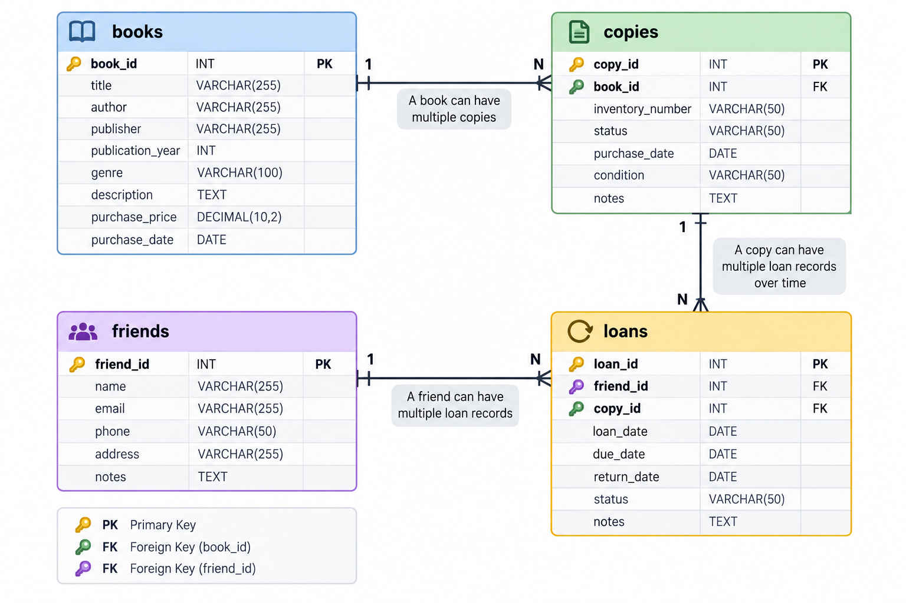
</p>

---

# Application Screenshots

## Dashboard

<p align="center">
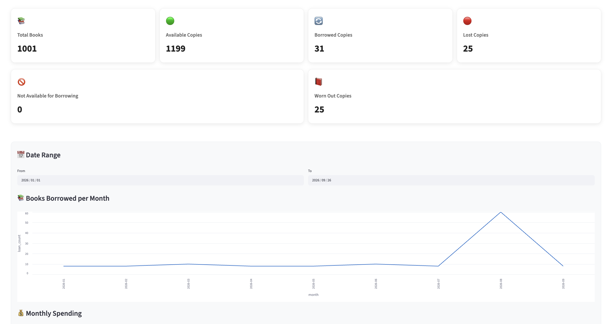
</p>
<p align="center">
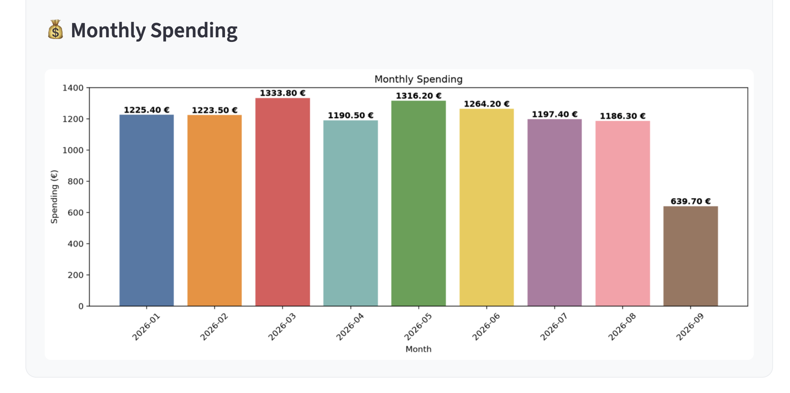
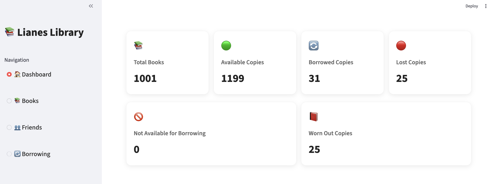
</p>
---

---

## Books

The Books section provides a visual overview of the library's books and physical copies.

### Book Overview and Filtering

The main Books page displays books as cards and provides filters for author, title, genre, and copy status.

<p align="center">
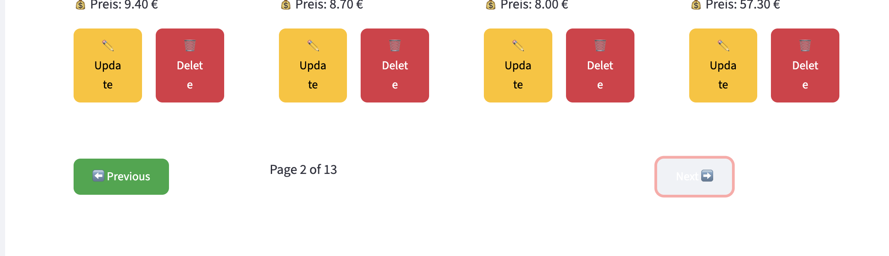
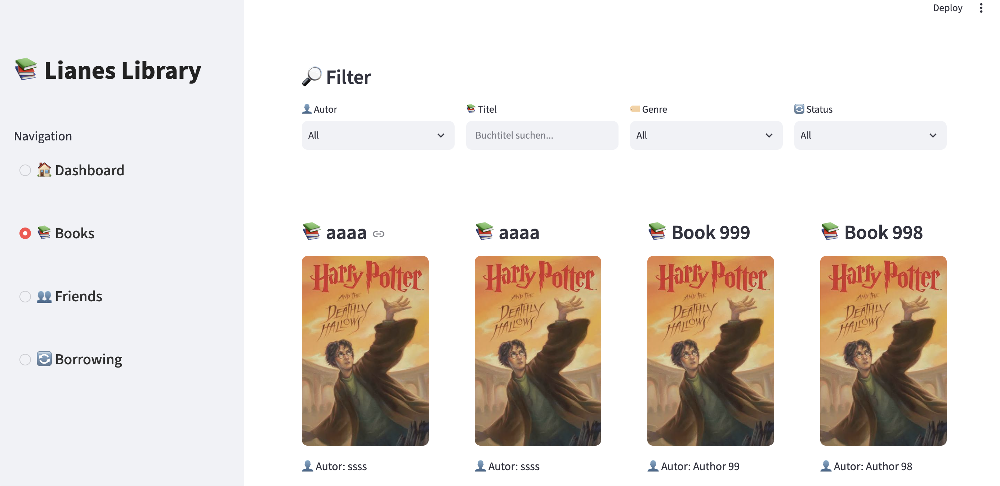
  
</p>

Users can browse the available books, view key information, and navigate through multiple pages of results.

---

### Book Information and Management

Each book card displays information such as the title, author, genre, copy status, and purchase price. Users can also update or delete individual copies.

<p align="center">
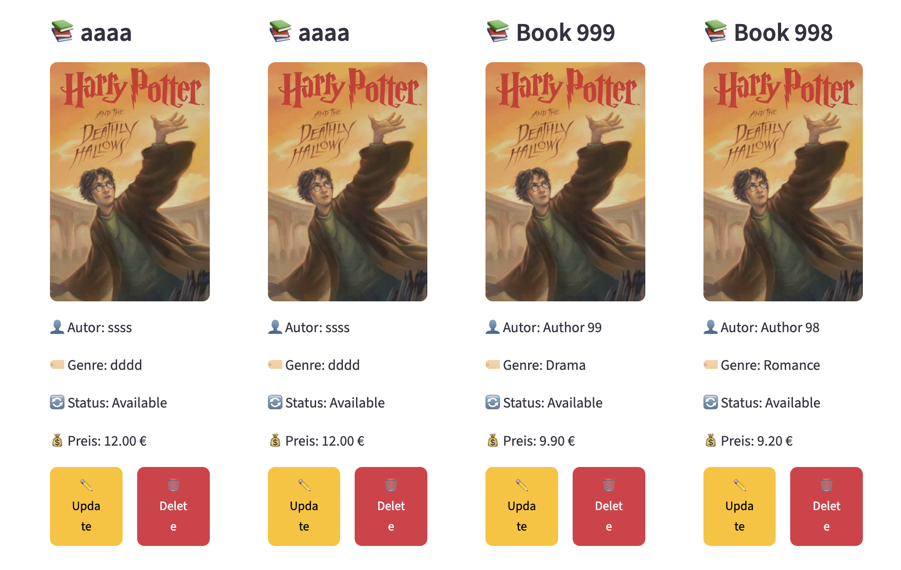
</p>

---

### Adding and Editing Books

The application provides forms for adding new books and managing their copies. Users can enter the book information, select the copy status, define the publication year and price, and specify the number of copies.

<p align="center">
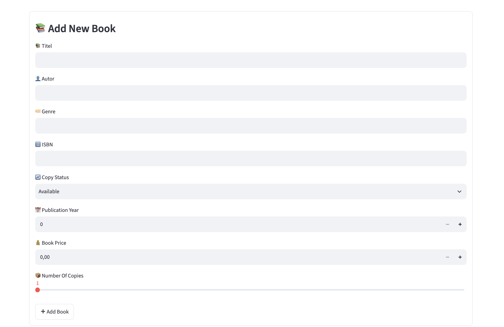
</p>

<p align="center">
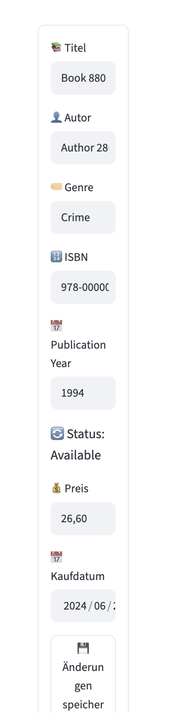
</p>

---

## Friends

The Friends section allows the library owner to manage people who borrow books from the private library.

### Friends Overview and Search

The main Friends page displays registered friends in individual cards and provides search and filtering options by first name, last name, and trust status.

<p align="center">
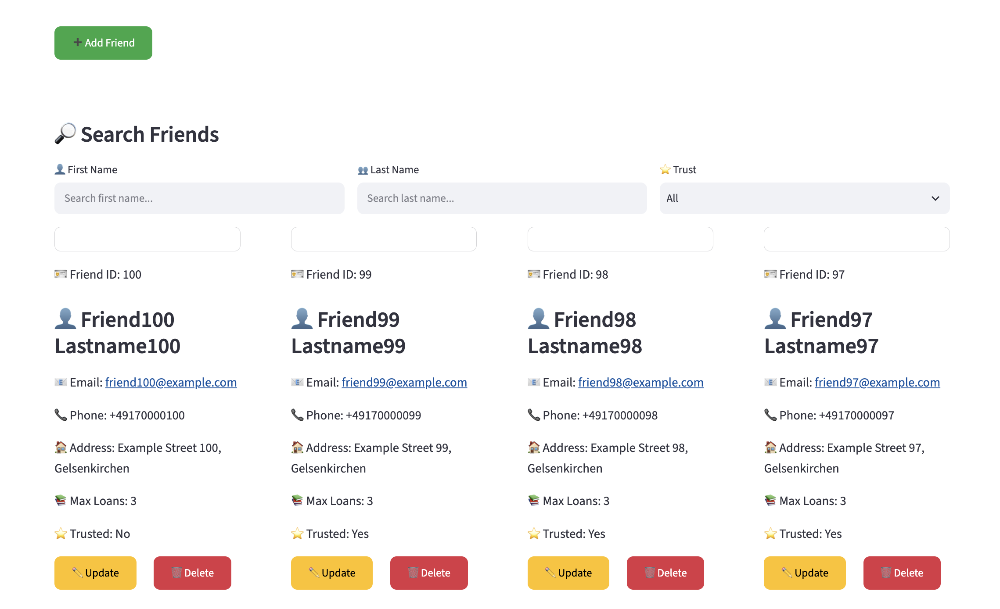
</p>

Each friend card displays contact information, maximum allowed loans, trust status, and management actions.

---

### Adding a Friend

The application provides a form for adding a new friend. The form includes personal and contact information, maximum loans, trust status, and optional notes.

<p align="center">
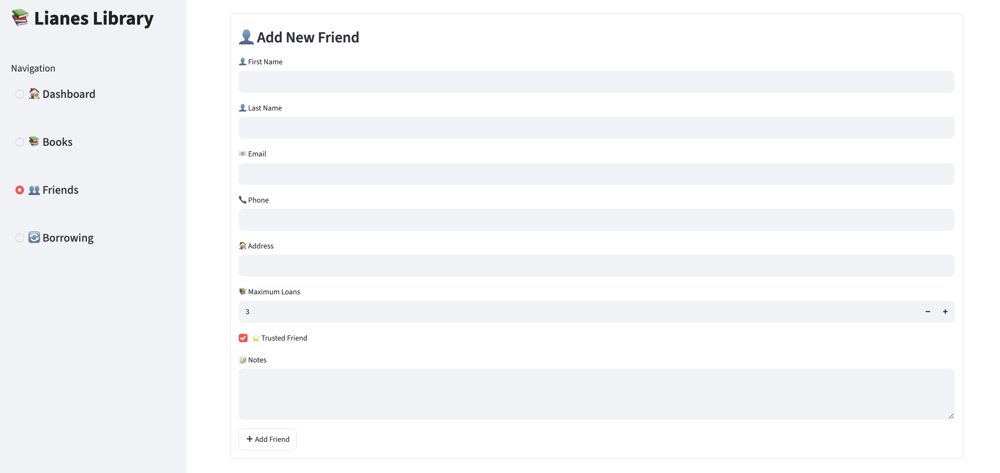
</p>

---

### Editing Friend Information

Existing friend records can be updated through the edit form. The owner can modify contact details, maximum loans, trust status, and notes.

<p align="center">
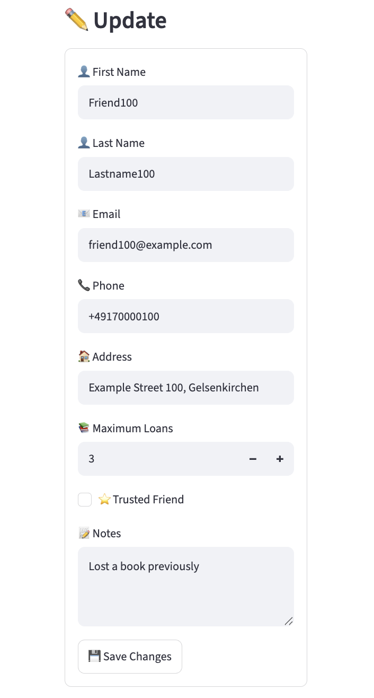
</p>

---

## Borrowing / Loans

The Borrowing section manages the lending process between the private library and its friends.

### Borrowing Overview

The main Borrowing page displays both open and completed loans. Users can filter loans by friend, loan type, and book.

<p align="center">
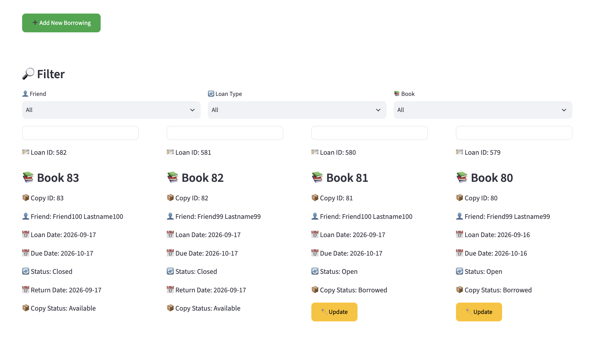
</p>

Each loan card shows the book, physical copy, borrower, loan date, due date, loan status, and return information when applicable. Open loans can be updated to finish the borrowing process.

---

### Creating a New Borrowing

A new borrowing can be created by selecting a friend and an available book copy.

<p align="center">
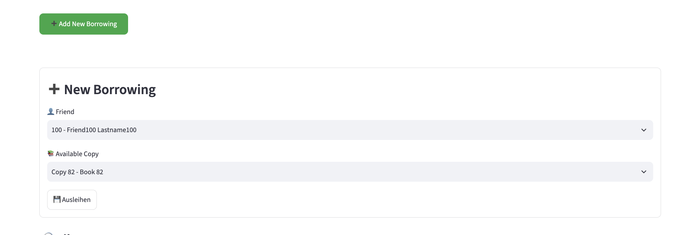
</p>

The system only presents available copies for a new borrowing.

---

### Finishing a Borrowing

Open borrowings can be updated when a book is returned. The library owner can select the resulting copy status and finish the loan.

<p align="center">
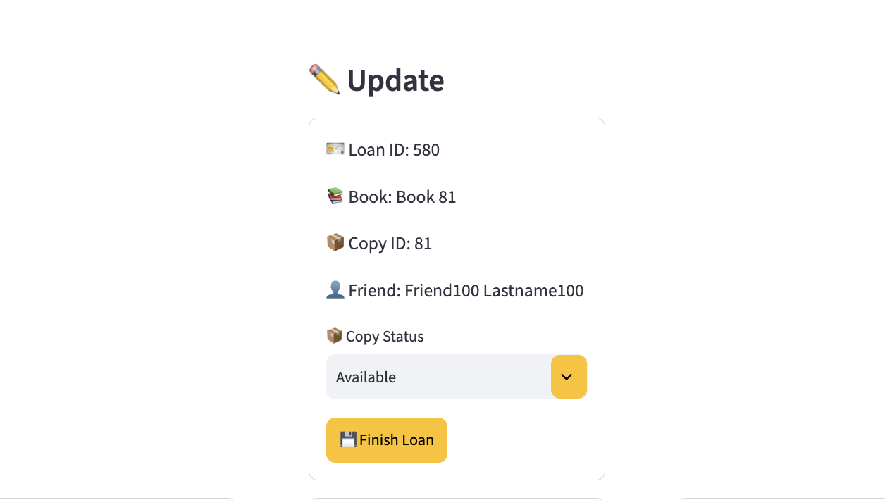
</p>


---

# Business Rules and Constraints

The application includes several business rules to protect the consistency of the library data and guide the library owner during daily operations.

### Book and Copy Management

- A book can have multiple physical copies.
- Each physical copy has its own status and purchase information.
- A copy cannot be deleted if it has loan history.
- If the deleted copy is the last physical copy of a book, the associated book record can also be removed.

### Friend Management

- A friend cannot be deleted if they have any borrowing history.
- Each friend has a configurable maximum number of active loans.
- The maximum loan value is used as a warning threshold. The final decision to allow an additional borrowing remains with the library owner.

### Borrowing Management

- Only copies with the `Available` status can be selected for a new borrowing.
- A borrowing records the friend, physical copy, loan date, and due date.
- Open borrowings can be completed by the library owner.
- When completing a borrowing, the owner can choose the resulting copy status, such as `Available` or `Lost`.

### Trust Management

- Friends can be marked as trusted or untrusted.
- If an untrusted friend is selected for a borrowing, the application displays a warning and asks the library owner for confirmation.
- The application does not automatically make the final decision on exceptional cases; the library owner remains in control.

# Technologies

This project was developed using:

- Python
- Streamlit
- MySQL
- SQLAlchemy
- Pandas
- Matplotlib
- Git
- GitHub

  # Skills Demonstrated

Throughout this project, the following technical and software development skills were applied:

- Python Application Development
- Streamlit Web Application Development
- Relational Database Design
- MySQL Database Management
- SQL Querying
- SQLAlchemy ORM
- CRUD Operations
- Database Relationships and Foreign Keys
- Transaction Management
- Data Validation and Business Rules
- Pandas Data Processing
- Data Visualization
- Interactive Dashboard Development
- Git Version Control
- GitHub Documentation

  # Future Improvements

Potential future enhancements include:

- Deploy the application to a cloud platform.
- Add user authentication and role-based access control.
- Add automated database backups.
- Improve book cover management and image handling.
- Add notifications for overdue loans.
- Add more detailed library statistics and reports.
- Add export functionality for library data.
- Improve mobile responsiveness.

  # Project Highlights

✔ Full-stack Python application with Streamlit

✔ Relational MySQL database integration

✔ Complete CRUD operations for books, copies, friends, and loans

✔ Business rules for data consistency and library management

✔ Interactive dashboard with statistics and visualizations

✔ Search, filtering, and pagination

✔ Transaction-based database operations

✔ Professional GitHub documentation

# Author

**Mustafa Al Hamoud**

IT Engineer | Data Analytics & AI Enthusiast

GitHub: https://github.com/Mustafa-Al-Hamoud


---

⭐ **If you found this project interesting, feel free to give it a star on GitHub!**
